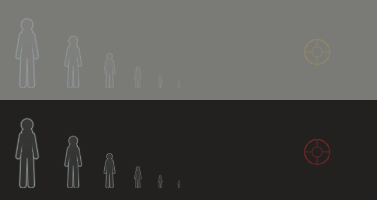

# Silent Hill Online

A branch of the PC port where other people are in your Silent Hill.

Not co-op. You are still playing the game alone, and nothing another player
does can touch your world — no shared enemies, no shared items, no shared
doors. What you get is the sense that the town is inhabited: pale outlines
moving through the fog where somebody else is walking right now, messages left
on the floor, and the spots where other people died.

Everything here is dormant unless `online_enabled = 1`. With it off, the build
opens no socket, starts no thread, and behaves exactly like the offline port.

---

## Running it

### 1. Start a master server

```
online_server/sh_master.exe -n "Fog" -m "Welcome to Silent Hill"
```

It listens on UDP 27888. For friends outside your network, forward UDP 27888
to the machine running it; on a LAN nothing needs forwarding.

| flag | meaning |
|---|---|
| `-p PORT` | listen port (default 27888) |
| `-n NAME` | server name players see |
| `-m TEXT` | message of the day |
| `-w WORD` | require a password |
| `-d FILE` | marker store path (default `memos.db`) |
| `--max N` | player cap (default 64) |
| `--no-ghosts` / `--no-memos` / `--no-deaths` | serve a subset |
| `-v` | log every query |

Markers are saved to `memos.db` — plain text, one per line, so a bad one can
be deleted with a text editor. It is written every 30 seconds when something
changed, and on a clean shutdown (Ctrl-C).

### 2. Point the game at it

In `config.cfg`:

```
online_enabled = 1
online_server  = 127.0.0.1
online_port    = 27888
online_name    = Harry
```

`net` in the in-game console reports the connection at any time.

---

## What you see



**Ghosts.** Other players on the same map, drawn as hollow humanoid outlines.
They occlude behind walls and fade into the fog exactly as world geometry
does, because they go through the game's own ordering table rather than being
pasted over the frame. A ghost hides during cutscenes and menus — during a
cutscene the other player is standing where the camera put them, not where
they walked.

**Messages.** Press `M` to leave one. You pick a phrase and a word from two
lists; there is no typing, which is deliberate — nothing to moderate, nothing
to translate at runtime, and a message costs four bytes on the wire. Walk over
somebody's message to read it.

**Death markers.** Placed automatically where you die, and visible to
everyone. Turn them off with `online_deaths = 0` if you would rather not know.

**The player list.** `F11`. Everyone connected, the area they are in, and
their ping.

---

## Keys

| key | what |
|---|---|
| `F11` | who is online |
| `M` | leave a message |
| arrows / Enter / Esc | drive the composer (pad works too) |

Both are `key_online_players` and `key_online_memo` in `config.cfg`.

---

## Console

```
net             connection, ghost and marker counts
net who         the roster, with areas and pings
net reconnect   drop and re-join
net memos       re-query this map's markers
```

---

## How it fits together

```
   your game                      master server                other players
 ┌──────────────┐   STATE 10Hz   ┌───────────────┐  SNAPSHOT  ┌──────────────┐
 │ sh_net_game  │ ─────────────▶ │  roster, by   │ ─────────▶ │              │
 │  reads       │                │  map          │            │              │
 │  g_SysWork   │ ◀───────────── │               │ ◀───────── │              │
 └──────────────┘   SNAPSHOT     │  marker store │   STATE    └──────────────┘
        │                        │  (memos.db)   │
        ▼                        └───────────────┘
 ┌──────────────┐
 │ sh_net_ghost │  draws into OT0, beside the bullet decals
 └──────────────┘
```

| file | job |
|---|---|
| `pc_port/include/sh_net_proto.h` | the wire format. Compiled verbatim by both ends |
| `pc_port/src/net/sh_net_platform.c` | the only file that sees winsock |
| `pc_port/src/net/sh_net_client.c` | protocol state machine, on a worker thread |
| `pc_port/src/net/sh_net_game.c` | the only file that reads `g_SysWork` |
| `pc_port/src/net/sh_net_ghost.c` | ghosts and markers, into the world OT |
| `pc_port/src/net/sh_net_art.c` | the generated silhouette and sigil |
| `pc_port/src/net/sh_net_memo.c` | phrase tables and the composer |
| `pc_port/src/net/sh_net_ui.c` | player list, composer, feed |
| `online_server/sh_master.c` | the server |
| `online_server/shnet_selftest.c` | drives a live server with two fake players |

The socket lives on its own thread, so a server that has gone away cannot
stall a frame. It publishes into a game-thread-private copy once per frame,
and every reader after that — including the renderer — works off that copy
with no lock at all.

---

## Testing without a second machine

```
sh_master.exe -p 27899 -d selftest.db -v
shnet_selftest.exe 127.0.0.1 27899
```

The self-test drives the server with two synthetic players and checks the
handshake, the ping, position fan-out with map isolation, roster paging,
marker placement and read-back, death de-duplication, and that a `STATE`
carrying somebody else's session from the wrong address is ignored.

To see the generated art without launching anything:

```
ghost_art_dump.exe      # ghost.png, marker.png, contact.png
```

`contact.png` is a contact sheet of the silhouette at the sizes it is actually
seen at, over both fog and a dark interior.

---

## Limits, honestly

- **Untested with real players.** Everything below the game — the protocol, the
  server, the fan-out, the marker store — is covered by the self-test and
  passes. What has never run is two copies of the game, on two machines,
  seeing each other. Expect that first session to find things.
- No name tags over ghosts. Projecting a world position into the overlay's
  coordinate space is a known trap in this port (the widescreen/Hor+ framing
  work), and it is not worth risking for v1. Names are in the player list.
- Ghosts are silhouettes, not character models. Drawing another player's
  actual body needs their model resident, which the chara pool could do —
  a later step.
- No voice, no text chat, no shared state of any kind. By design.
- Markers are per-map, not per-room, so a marker on another floor of the same
  map is still in your list. It is range-culled before it is drawn.

## Not yet, but designed for

The protocol already carries a second clause for messages (`phraseB`/`wordB`),
a `SAVE` marker kind, and a per-player character id, none of which the client
uses yet. The `online_ghost_style` setting has a slot for drawing real models.
None of that needs a protocol version bump.
